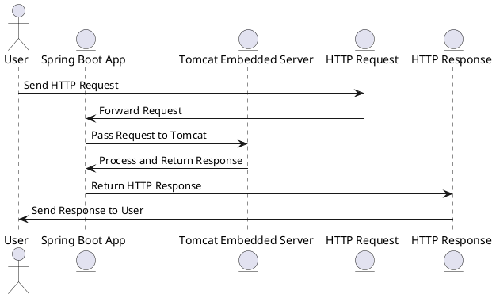

# Tomcat

## Spring Boot集成Tomcat



通过spring-boot-starter-web依赖集成Tomcat

```xml

<dependency>
    <groupId>org.springframework.boot</groupId>
    <artifactId>spring-boot-starter-web</artifactId>
</dependency>
```

在spring-boot-starter-web中依赖了spring-boot-starter-tomcat

```xml

<dependency>
    <groupId>org.springframework.boot</groupId>
    <artifactId>spring-boot-starter-tomcat</artifactId>
    <version>${version}</version>
    <scope>compile</scope>
</dependency>
```

